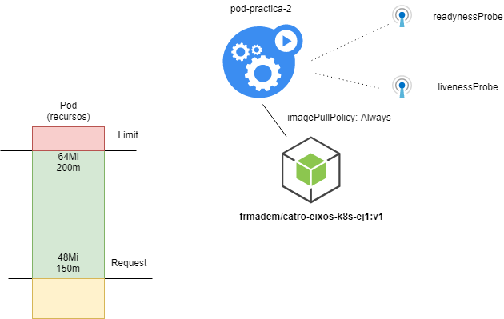
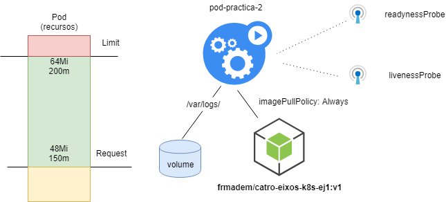
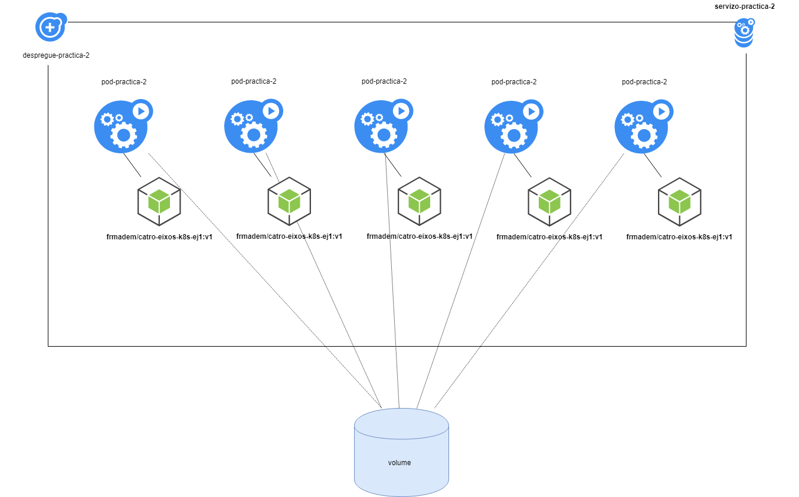

# Mellorando a nosa aplicación.

Para facer esta tarefa, primeiro compre ler a documentación sobre "[avanzando en Kubernetes](https://formacion.4eixos.com/k8s/tema3/)". 

Imos mellorar o noso despregue de aplicación da tarefa [2.3](https://formacion.4eixos.com/k8s/actividades/2/correndo_a_nosa_primeira_aplicacin_en_kubernetes.html). 

Polo tanto, é necesario ter rematada esa tarefa antes de acometer a de este módulo. 

## A) Mellorando o noso pod

Unha vez lida a documentación, sacamos en conclusión que unha das melloras que podemos facer ós nosos pods é a de dotalos de sondas que nos permitan determinar:

* Cándo está listo para recibir peticións (readinessProbe)
* O seu estado de "saúde" (livenessProbe)

Asemade, e para que o scheduler (o compoñente de K8s encargado de determinar o nodo do clúster no que van a correr os nosos pods) faga ben o seu traballo, compre introducir limits e requests. 

Compre modificar o pod da tarefa 2.3 a) cos seguintes cambios:

* Mudarlle o nome ó pod, chamarase "pod-practica-2"
* Hay que lle meter a [política](https://kubernetes.io/docs/concepts/containers/images/) de "ImagePullPolicy: Always". 
* Agregarlle unha sonda de ready e unha de live
	* Faránse a través de peticións get a /servidor
	* A sonda de ready iniciaráse ós 15 seg de vida do contedor e se repetirá ata cada 5 seg. 
	* A sonda de live iniciarase ós 20 seg e se repetirá cada 10 seg. 
* Por outra banda, imos crear uns limits e requests ós nosos pods
	* Como limits, haberá 64Mi e 200m
	* Como requests, teremos 48Mi e 150m
* Por último imos cambiar a política de pullIimage e obligar a que Kubernetes intente buscar cambios na imaxe do pod cada vez que se arrinca ([imagePullPolicy](https://kubernetes.io/docs/concepts/containers/images/))

Con todos istos cambios, hai que xerar un novo yaml que cumpra os requisitos do da tarefa 2.3.a) mais estes novos (o yaml chamaráse pod_mellorado.yaml)

Compre tamen arrancalo. 

Unha vez feito teríamos o seguinte:

## A) Agregando persistencia

Resulta que a nosa aplicación tiña logs!! 

Eses logs de acceso estánse a perder por mor de que os nosos pods non teñen persistencia. 

Imos darlle persistencia ó noso sistema. 

* Borra o pod do apartado anterior
* Baseándote en él, crea un novo ficheiro que se chame pod_mellorado_volume.yaml
* No pod hai que facer os seguintes cambios:
	* Agregar unha nova variable de contorna que estableza os logs RUTA_LOGS=/var/log (os teremos así en /var/log/k8s_access.log)
	* Compre tamén crear un volume:
		* Será de tipo hostPath
		* Ten que apuntar a /tmp/k8s_logs
		* Ten que chamarse volume-logs

Cando o teñas listo:

* Arranca o pod
* Comproba que na ruta /tmp/k8s_logs hai un log k8s_access.log
* Fai un port-forward do pod
* Faille peticións a /servidor
* Mostra o contido do log con un tail. 

O sistema agora, quedaría como segue:

## C) Engandindo un deploy, un configmap e un servizo

Agora que temos o pod ben preparado, imos a metelo dentro dun deploy que o controle. 

* Borra o pod do apartado anterior
* Compre crear un deploy:
	* O seu nome será despregue-practica-2
	* Os pods serán do tipo do apartado anterior (cuidado co selector!!!)
	* Terá como labels:
		* app=pod-practica-2
		* practica=modulo_3_1
	* Os pods van empregar un ConfigMaps:
		* Terá de nome "config-practica-2"
		* Terá como labels:
			* app=pod-practica-2
			* practica=modulo_3_1
		* Terá a configuración do
			* PUERTO_APP=80
			* RUTA_LOGS=/var/log
	* O despregue expórtase a través dun servizo
		* terá de nome "servizo-practica-2"
		* as súas labels serán
			* app=pod-practica-2
			* practica=modulo_3_1
		* Escoitará no porto 80 (port = 80)

Polo tanto, precisamos de tres artefactos:

* Deploy (despregue_practica_2.yaml)
* ConfigMap (config_practica_2.yaml)
* Service (servizo_practica_2.yaml)

O diagrama do que temos quedaría como este (non se mostran as sondas e os límites por falta de espazo):

Unha vez tes todo preparado:

1. Arranca os tres artefactos (pola orde correcta). 
1. Comproba que están a funcionar os tres. 
1. Averigua a ip do servizo. 
1. Escala a 5 réplicas e agarda a que estén ready. 
1. Fai curls ó <ip_servizo>/servidor. 
1. Fai un tail do archivo de logs. 
1. Borra os tres artefactos mediante o emprego de labels non de names.

- - -

**Evidencias da adquición dos desempeños:**

* Envío dun pdf cos contidos necesarios para realizar os puntos do a) ó c) segundo estes

**Indicadores de logro:** Deberías ter:

* Artefacto co yaml necesario para crear o pod cos requisitos do **punto a)** (pod_mellorado.yaml). Captura de pantalla dos comandos necesarios para:
	* Arrancar o yaml 
	* Comprobar que o pod está a correr (e a súa saída)
* Artefacto co yaml necesario para crear o pod cos requisitos do **punto b)** (pod_mellorado_volume.yaml). Captura de pantalla cos comandos necesarios para:
	* Arrancar o yaml
	* Exportar o pod a un porto da máquina ou host
	* Saída do log en /tmp/k8s_logs/k8s_access.log do host
* 3 artefactos (ConfigMap, Deploy e Service) cos requisitos do **punto c)** (config_practica_2.yaml, despregue_practica_2.yaml e servizo_practica_2.yaml) Captura de pantalla coas salidas e comandos necesarios para:
	* Arrancar a estrutura e comprar que está a funcionar
	* Escalar o despregue a 5 réplicas
	* Saída do tail (en host) de /tmp/k8s_logs/k8s_access.log
	* Borrado dos artefactos (por labels)

**Criterios de corrección:**

* Ata 10 puntos do apartado a) 
	* 8 puntos se o yaml de creación do pod está correcto
	* 1 puntos por cada comando / captura de saída correcto. 
* Ata 10 puntos do apartado b)
	* 7 puntos se o yaml de creación do pod mellorado e con volume está correcto.
	* 1 punto por cada comando/captura de saída correcto. 
* Ata 20 puntos do apartado c)
	* 4 puntos se os yaml de deploy, configmap e servizo están correctos. 
	* 2 punto por cada comando/captura de saída correcto. 

**Autoavaliación**: Autoavalía esta tarefa aplicando os indicadores de logro anteriores

**Peso na cualificación:**

* Peso desta tarefa na cualificación final  ........................................ 40 puntos
* Peso desta tarefa no seu tema ...................................................... 40 %

# Montar a nosa aplicación nun clúster de Kubernetes

Imos correr a nosa aplicación nun clúster real de Kubernetes. 

Para facer isto compre revisar a documentación [sobre usuarios e roles](https://formacion.4eixos.com/k8s/tema_3_addenda/index.html).

 O administrador do clúster vainos pedir unha serie de elementos:

* Un certificado xerado por nós para poder traballar contra a API do clúster. 
* Un artefacto que cree o noso namespace, onde imos traballar. 
	* O namespace terá o seguinte formato: <inicial_nome_pila>-<primer_apelido>
	* Exemplo: (Francisco Maseda)  f-maseda
* Un artefacto que cree un Role 
	* Ten que dar permisos sobre os seguintes recursos
		* ConfigMaps
		* Services
		* Pods
		* Deploys
	* Os permisos serán de lectura e escritura (verbos POST, PUT, PATCH, GET, WATCH, LIST)
* Un RoleBinding para linkar o Role ó usuario no namespace noso. 

Esos obxectos e o certificado **deberán ir nun tar** que remitiremos ó administrador mediante email (para Francisco Maseda ou Javier Gómez)

## A) Xerar as nosas credenciais

Para xerar as nosas credenciais compre seguir esta [guía](https://formacion.4eixos.com/k8s/guias/xeracion-certificados/).

Copiamos á nosa ruta de tar o certificado .csr (por exemplo f.maseda.csr)

## B) Crear os artefactos de namespace, Role e RoleBinding

O administrador tamén nos pide que declaremos os artefactos necesarios para crear:

* Namespace:
	* O nome do namespace terá o formato do que falamos enriba
	* Terá como label: tipo=platega-alumno
* Role:
	* Terá como nome "role-alumno"
	* Compre que teña o label: tipo=platega-alumno
	* Ten que dar permisos sobre os seguintes recursos
		* Pods
		* Servizos
		* Deploys
		* ConfigMaps
	* Os permisos serán de lectura-escritura (GET, POST, PUT, WATCH, LIST, PATCH)
* RoleBinding
	* Tera como nome binding-alumno
	* Aplicaráse ó usuario nomeado co formato que establecemos ( <inicial_nome_pila>-<primer_apelido>)
	* Compre que teña o label: tipo=platega-alumno
	* Será sobre o namespace creado 

Os tres yaml (namespace.yaml, role.yaml, role_binding.yaml) introduciránse no tar a enviar. 

## C) Envío ós administradores do clúster

O tar enviarase ó administrador (Francisco Maseda ou Javier Gómez) mediante email. Responderán cun certificado. 

## D) Instalación do certificado no microk8s.kubectl

Unha vez obtemos o certificado dos administradores:

* Agregamos unha nova configuración para o clúster
* Chamaráse "platega"
* O server ten como dirección: https://35.205.163.207
* Hai que facer o insecure-skip-tls-verify=true
* Agregamos un novo usuario (co nome tal e como o temos no RoleBinding)
* Hai que lle meter o certificado que nos devolveu o administrador (opción --embed-certs=true)
* A key xerada no **apartado a)**
* Agregamos un novo contexto
* Co nome "contexto-platega"
* Asociará o clúster "platega" ó noso usuario

Listamos os contexts que temos. 

## E) Creación do noso despliegue da tarefa 3.1 no clúster

Poñemos o current-context a "contexto-platega". 

Lanzamos o configmap, deploy e service do **apartado c)** da tarefa anterior. 

Avisamos por mensaxe privada ó administrador de que temos o sistema instalado no clúster. 

- - -

**Evidencias da adquición dos desempeños:**

* Envío dun tar por email cos contidos necesarios para realizar os puntos do **a)** e **b)** segundo estes

**Indicadores de logro:** Deberías ter:

* Xerado correctamente un certificado según se indica no apartado a). 
* Yaml correctos para:
	* Crear un namespace coas especificacións do apartado b)
	* Crear un Role segundo as especificación do apartado b)
	* Crear un RoleBinding segundos as especificación do apartado b)
* Lanzar a nosa aplicación no clúster (despois de facer os pasos do apartado c) ) e avisar ós administradores por mensaxe privada. 

**Criterios de corrección:**

* Ata 20 puntos do apartado a) e b)
	* 5 puntos se o certificado está correcto. 
	* 5 puntos se o artefacto de creación do namespace é correcto
	* 5 puntos se o Role está correcto. 
	* 5 puntos se o RoleBinding está correcto. 
	* 1 puntos por cada comando / captura de saída correcto. 
* Ata 20 puntos do apartado d)
	* 20 puntos se o desplegue, configmaps e o servizo están a correr no clúster. 

**Autoavaliación:** Autoavalía esta tarefa aplicando os indicadores de logro anteriores

Se tes algunha dúbida ou consulta sobre como realizar a tarefa formúlaa no [Foro de consultas](https://www.edu.xunta.gal/platega/mod/forum/view.php?id=110051) deste tema. 

**Peso na cualificación:**

* Peso desta tarefa na cualificación final  ........................................ 40 puntos
* Peso desta tarefa no seu tema ...................................................... 40 %

# Familiarizarse e traballar cos Dockerfiles

Nesta tarefa, imos adicar o noso tempo a traballar co sistema de Dockerfiles e crear as nosas imaxes de contedores. 

Para poder traballar coas nosas imaxes imos comezar por construir o noso propio [registry](https://hub.docker.com/_/registry/) de imaxes. Neste senso, empregaremos o software de registry de Docker. Podedes atopar información de despregue aquí.

Logo de ter creado o noso registry propio, imos almacenar nel as imaxes que produciremos para o proxecto de docker-meiga.

## O proxecto docker-meiga

Temos un proxecto que se chama [docker-meiga](https://github.com/prefapp/docker-meiga), trátase dunha web en html5 cun motor en PHP. 

O proxecto vaise despregar nun contedor, e hai que construi-lo Dockerfile da imaxe. 

## Requisitos

* A imaxe para a versión 1 (a que temos agora) precisa de PHP.
* Pódemos emprega-la imaxe oficial de [php](https://hub.docker.com/_/php/) que hai en dockerhub (php:7.2).
* Como servidor web usarémo-lo [interno de PHP](https://www.php.net/manual/es/features.commandline.webserver.php).
* A aplicación precisa de dúas variables de entorno definidas (CURSO e DOCENTE)

## Procedemento de construcción

Partindo da imaxe fonte:

* Hai que instala-lo software necesario para clona-lo repo
* Establece-lo como ruta de traballo 
* Defini-lo entorno que sexa preciso (docente co seu nome, nome de este curso...)
* Lanzar o servidor web

Pasos: 

1. **Consultar** e **analizar** a documentación sobre  [imaxes e contedores](https://formacion.4eixos.com/tema_3_web/index.html).
1. Nun pdf, os capturas de pantalla de todo o necesario para:

	1. **Crear unha imaxe** a partir da oficial de registry co seguinte nome: #nome-registry, sendo #nome o nome de pila do alumno.
	1. **Lanzar unha instancia** do registry coa imaxe creada, esta instancia ten que reuni-los seguintes requisitos:
		* O nome do contedor será #nome-registry-formacion, sendo #nome o nome de pila do alumno. 
		* O registry ten que correr no porto 5050
		* Precisamos que teña almacenamento persistente, nun directorio da máquina anfitrión.
	1. Crear unha imaxe para o docker-meiga:
		* Dockerfile de construcción da imaxe de docker meiga segundo os requisitos establecidos. 
		* O comando de construcción da imaxe (a imaxe ténse que chamar docker-meiga)
		* O comando de subida da imaxe ó rexistro privado de imaxes do punto anterior. 
	1. O comando de lanzamento dun contedor baseado na imaxe de docker-meiga:
		* Ten que correr como un demonio
		* O porto de conexión ten que ser o 8000
		* O nome do contedor será meiga-v1
		* Aportar unha captura do navegador coa aplicación web funcionando
1. **Mellorando** o Dockerfile
	* No pdf aportar un dockerfile que reduza o tamaño da imaxe final
1. **Permitir** varias ramas no Dockerfile
	* Aportar un novo Dockerfile onde se poidan establecer distintas ramas do repo coincidindo con distintas versión da aplicación. A versión a construir pasaráse como un argumento no momento de construí-la imaxe. O nome do argumento será a rama.  

**Evidencias da adquisición dos desempeños:** Pasos 2, 3 e 4 correctamente realizado segundo estes...

**Indicadores de logro:** debes...

1. Entregar un pdf cos
	1. comandos para montar o registry privado. 
	1. o Dockerfile de creación da imaxe
	1. os comandos para correr un contedor coa imaxe
	1. o Dockerfile de mellora 
	1. o Dockerfile con ramas

**Criterios de corrección:**

* Registry privado (máx 10 puntos)
	* **2 puntos** de ter creada a imaxe do registry
	* **4 puntos** se o comando de arranque do registry privado é correcto
	* **4 puntos** se a configuración da persistencia é correcta
* Imaxe e contedor de docker-meiga (max de 20 puntos)
	* **6 puntos** se o Dockerfile de construcción da imaxe de meiga é correcto
	* **2 puntos** se o comando de construcción da imaxe é correcto. 
	* **2 puntos** se os comandos de subida da imaxe ó registry privado son correctos. 
	* **8 puntos** se o comando de arranque do contedor é correcto. 
	* **2 puntos** se hai adxunta unha imaxe do navegador coa aplicación correndo.
* Imaxe mellorada
	* **5 puntos** se a imaxe do Dockerfile reduce o tamaño da imaxe do punto anterior. 
* Imaxe con ramas
	* **5 puntos** se o Dockerfile acepta rama. 

**Autoavaliación: Autoavalíate aplicando os indicadores de logro e mesmo os criterios de corrección.**

**Heteroavaliación:** A titoría avaliará e cualificará a tarefa.

**Peso na cualificación:**

Peso desta tarefa na cualificación final  ........................................ 40 puntos
Peso desta tarefa no seu tema ...................................................... 40 %
